# LTE-Comparator 5-bit Flash ADC with dual stage Encoding Logic using Google SkyWater 130nm PDK and eSim

Featured in this repository is the Design and Analysis of a 5-bit Flash ADC build with the help of LTE Comparators and interfaced with a custom digital logic of 5-to-32 Decoder and 32-bit Priority Encoder. The design was done in eSim tool by FOSSEE, IIT Bombay using the Google SkyWater 130nm Process Design Kit.

# Table of Contents
 * [Introduction](#Introduction)
 * [Literature Survey](#Literature-Survey)
 * [Working Principle](#Working-Principle)
 * [5-Bit Flash ADC Design](#5-Bit-Flash-ADC-Design)
 * [Custom Digital Logic](#Custom-Digital-Logic)
 * [Tools Used](#Tools-Used)
 * [Analog Blocks Design and Simulation](#Analog-Blocks-Design-and-Simulation)
 * [Digital Logic Blocks Design and Simulation](#Digital-Logic-Blocks-Design-and-Simulation)
 * [Observations & Conclusion](#Observations-&-Conclusion)
 * [Author](#Author)
 * [Acknowledgements](#Acknowledgements)
 * [References](#References)

# Introduction

Processing is vital to the computing devices in today's modern electronic world but these processing circuits don't generally operate on one type signals. Circuits are widely categored under - Analog and Digital circuits. The work shown here is aimed at presenting the design of a 5-bit Flash Architecture based Analog to Digital Converter that uses a Linear Tunable Transconductance Element as its Comparator block [LTE Comparator] and features conversion of the thermometer codes to Gray codes using a thermometer to gray encoder. The result of the flash ADC is then sent through a custom logic block comprising of a decoder and a 32-bit Priority encoder. The implementation focuses on using Flash ADCs to manipulate signals in the Mixed Signal domain. The main advantages of using LTE based Comparator here is improved PSRR (Power Supply Rejection Ratio) and the DCVSL structure of Thermometer Encoder helps to avoid the static power dissipation and achieve high speed. This mixed signal interface with digital logic helps in establishing a priority-like encoding criteria for the continuous signals similar to their digital counterparts.

Modern day computing has many ADC architectures such as successive approximation register [SAR], sigma delta [∑∆], and dual slope. Flash ADCs in particular have a high data conversion speed, low resolution, and large chip area along with large power dissipation and are therefore preferred for providing high sampling rates. The flash ADC is designed for n = 5 bits, which implies 25-1, i.e., 31 LTE Comparator blocks chain followed by a DCVSL logic style thermometer to gray encoder constituting the Analo lock of the design. This part of the design is implemented via eSim and NgVeri. The latter digital logic blocks of 5-to-32 decoder and 32-bit priority encoder for encoding gray codes to their binary equivalents are designed completely using Verilog HDL.

# Literature Survey

The world is Analog but the processing it does is digital, with that thought in mind the idea of Mixed Signal SoC Design came into being. In Layman's terms, mixed-signal ICs are integrated circuits that contain both analog and digital circuitry on one chip. An analog signal is a continuous time-varying signal, and a digital signal is a noncontinuous signal that takes on only a finite number of values. Mixed signal ICs make use of both of these types of signals. Mixed-signal ICs are used in a wide variety of applications and application-specific integrated circuits (ASICs).

The real world signals are mostly analog in nature and hence, an analog to digital converter is needed to transmit effectively the analog signals to digital signals. This paper describes the comparator circuits used in most of the analog circuits now-a-days. Comparators play a vital role in most of the analog circuits like Flash ADC’s and the performance of these circuits is greatly influenced by the choice of comparators.

A prime example of Mixed Signal Integrated circuit would be a DAC or a ADC, both of which are composed of blocks that are Digital as well as Analog in nature. For the design featured here, a flash ADC was chosen because it is the fastest ADC in the analog to digital conversion which is employed popularly in high-frequency applications. The comparator is a major block used in the flash ADC for analog to digital conversion. The use of comparators count is varied depends on the resolution of the flash ADC. Comparator count increases as 2n for an n-bit resolution flash ADC. 

# Working Principle

Fig 1: Reference Circuit for LTE Comparator

With respect to the Fig. 1 above, the circuitry of the design follows a mixed approach wherein some part is designed in SPICE using netlists and some part is designed using Hardware Description Language [Verilog]. But the overall principle on which this SoC works can be broadly jotted down in the following:
--Analog Blocks
• The LTE Comparator based  5-bit Flash ADC takes an Analog Input
• The input is processed by the 31 Comparator blocks to give corressponding digital outputs as a result of the comparison
• The 31-bit code, also known as, Thermometer code is then encoded into 5 Gray codes using the Thermometer to Gray Encoder which again is designed using SkyWater 130nm PDK
--Digital Blocks
• Now, then the custom digital logic blocks are connected which are composed of a 5-to-32 thermometer decoder and a 32-bit Priority Encoder using Cascading Logic.
• So, the 5-bit Gray Code is received by the decoder which decodes the gray codes into a 32-bit sequence with the most significant bit as the unsigned bit and the remaining bits as the thermometer code. 
• The output from the decoder is then given to a 32-bit priority encoder which comprises of four 8-to-3 active low priority encoders cascaded together. 
• The Priority Encoder then as per the highest priority algorithm gives the 5-bit binary output equivalent of the Gray codes.

To sum up, not only does the complete Mixed Signal design focuses on the data conversion part and generating gray codes from the flash ADC but also on the custom digital logic design part which then decodes the gray codes back into the thermometer codes along with converting them into their binary code equivalents.  

# 5-Bit Flash ADC Design

## LTE Comparator

The CMOS-LTE Comparator uses Linear Tunable Transconductance Element and inverter as shown in Fig. 2. The internal reference voltages are generated by systematically varying the transistor sizes of the CMOS linear tunable transconductance element. All transistor sizes of this element are identical in this design, with Vg1 and Vg4 as fixed voltages. The output of this component is connected to CMOS inverter to increase the voltage gain of the comparator.

 
  Fig 2: Reference Circuit for LTE Comparator

## Thermometer to Gray Encoder

The thermometer to gray encoder works on the principle of generating 5 individual gray bits using a DCVSL logic style circuitry [shown in Fig. 3]. The individual sub-circuits together compose the thermometer to gray encoding logic.

   
  Fig 3(a): DCVSL Logic for Thermometer to Gray Encoder

  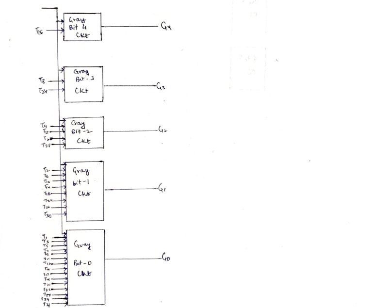 
  Fig 3(b): Thermometer to Gray Encoder using DCVSL Logic Generation Ckts

# Custom Digital Logic

## 5-to-32 Gray to Thermometer Decoder

This design is done in Verilog using the Behavioral Model and the Truth table for the same is shown below in Fig 4. 

  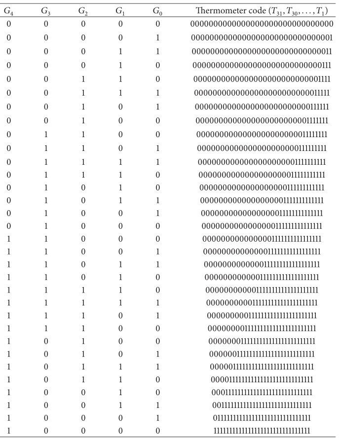 
  Fig 4: Truth Table for 5-to-32 Decoder

NOTE: Now, it is important to mention that this decoder gives an unsigned most significant bit as 0 to form the 32-bit binary sequence to be fed into the Priority Encoder next which does not the affect the highest priority logic of the encoder.

## 32-bit Priority Encoder using Cascading Logic

  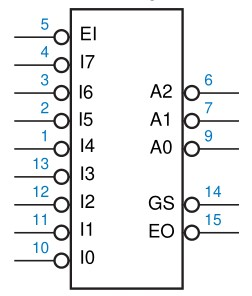 
  Fig 5(a): Active low 8-to-3 Priority Encoder

  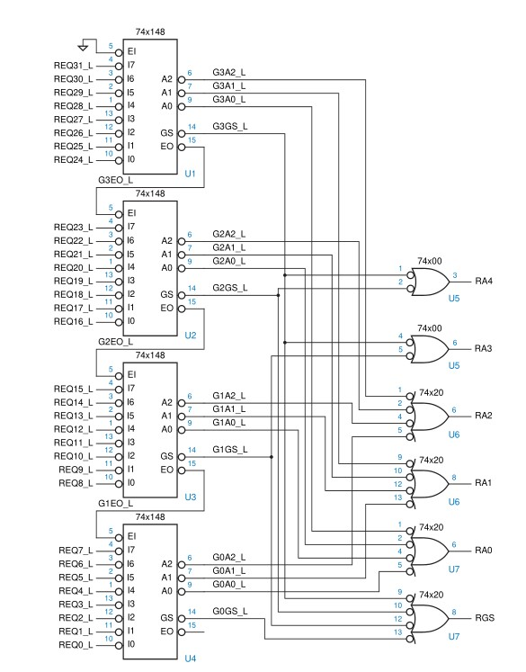 
  Fig 5(b): 32-bit Priority Encoder with Active low inputs formed by cascading four 8-to-3 Priority Encoder

  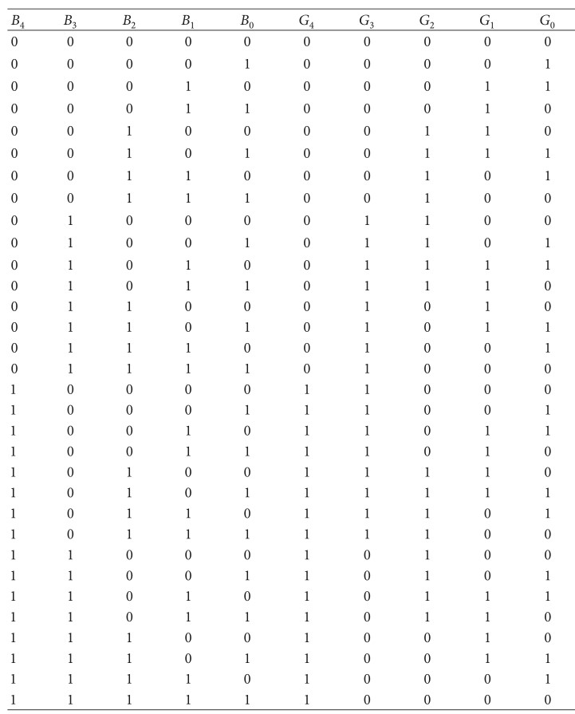 
  Fig 5(c): 5-bit Gray to Binary Truth Table to verify Priority Encoder output

NOTE: The output from the priority encoder is the correct binary equivalent of the Gray Code received in the decoder from the Flash ADC indicating that the Digital Logic is unaffected by the Most Significant unsigned bit mentioned in the above decoder NOTE section.

# Tools Used

<b>• eSim:</b> 
eSim (previously known as Oscad / FreeEDA) is a free/libre and open source EDA tool for circuit design, simulation, analysis and PCB design
It features of list of add-ons that together composes the various applications the software has to offer such as:
• KiCAD
• NgVeri
• MakeChip IDE

To know more, kindly refer to: <a href='https://esim.fossee.in/home'>eSim</a> 

  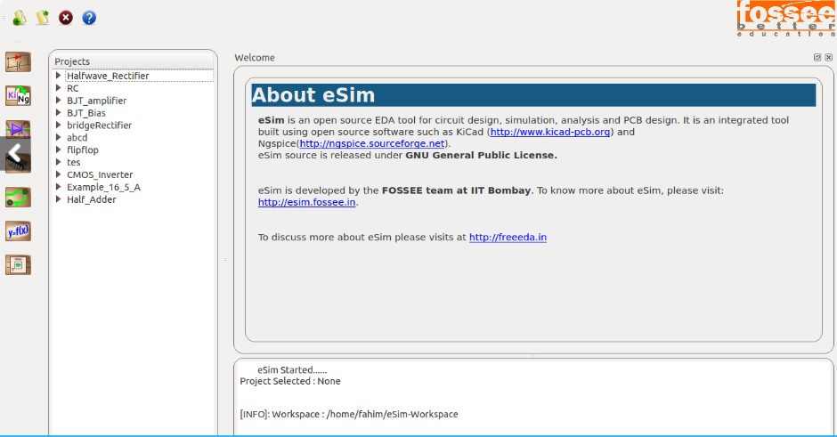 

<b>• Google SkyWater:</b> 
The SkyWater Open Source PDK is a collaboration between Google and SkyWater Technology Foundry to provide a fully open source Process Design Kit and related resources, which can be used to create manufacturable designs at SkyWater’s facility.
To know more, kindly refer to: <a href='https://github.com/google/skywater-pdk'>Google SkyWater Github</a> 

   

# Analog Blocks Design and Simulation

## LTE Comparator

The schematic and component symbol of the DRAM was designed at a transistor-level using the 28nm PDK library on the Custom Compiler Schematic Editor.

  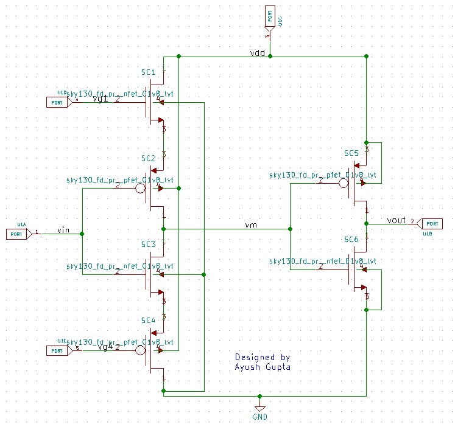 
  Fig. 6(a) : Comparator Schematic

  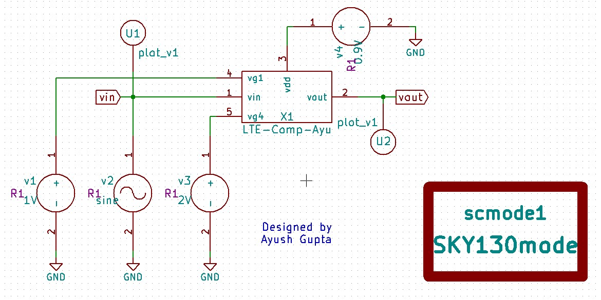 
  Fig. 6(b) : Comparator Symbol and Testbench

## DCVSL logic Thermometer to Gray Encoder

### Gray bit-4 Circuit

  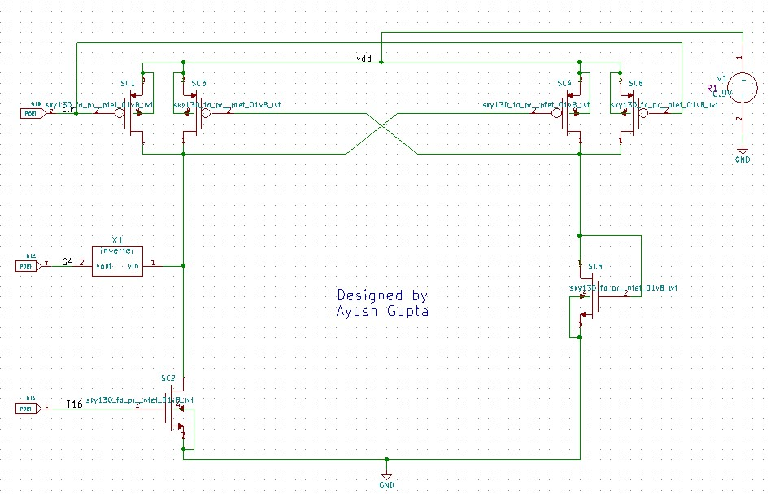 
  Fig. 7(a): Gray Bit-4 Generation Schematic

  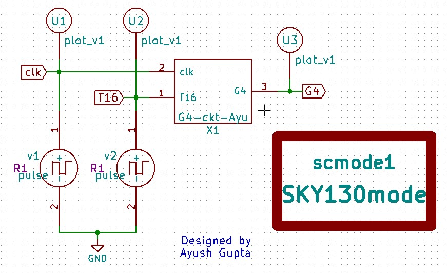 
  Fig. 7(b): Symbol and Testbench

### Gray bit-3 Circuit
<

  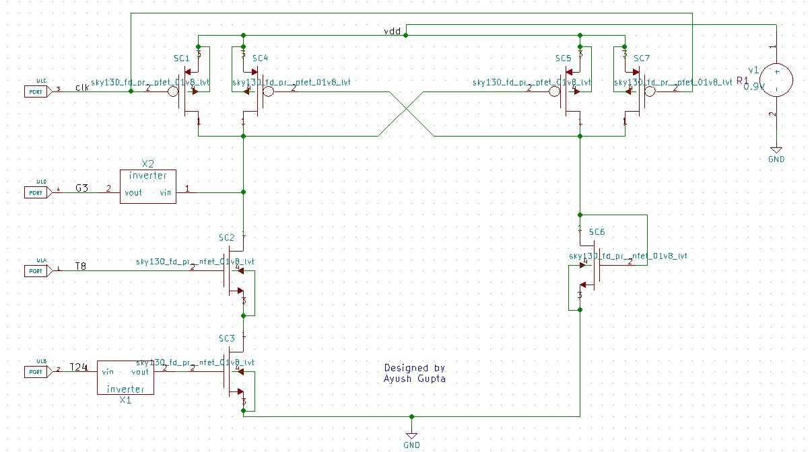 
  Fig. 8(a): Gray Bit-3 Generation Schematic

  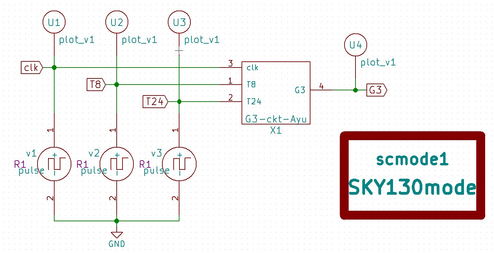 
  Fig. 8(b): Symbol and Testbench

### Gray bit-2 Circuit

  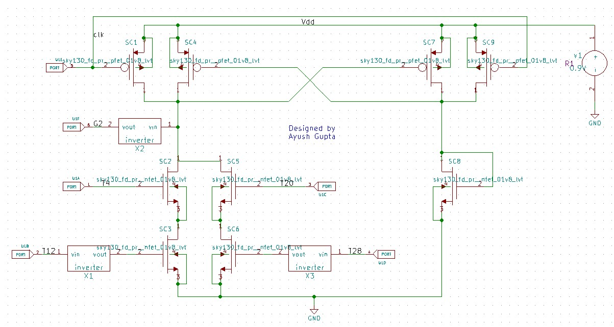 
  Fig. 9(a): Gray Bit-2 Generation Schematic

  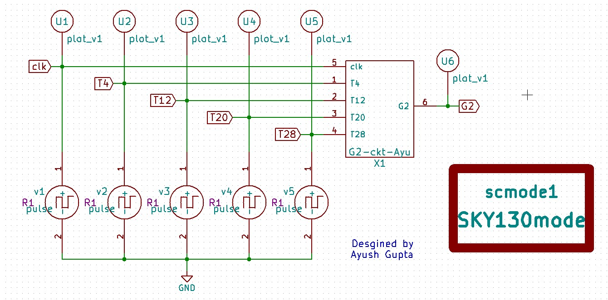 
  Fig. 9(b): Symbol and Testbench

### Gray bit-1 Circuit

  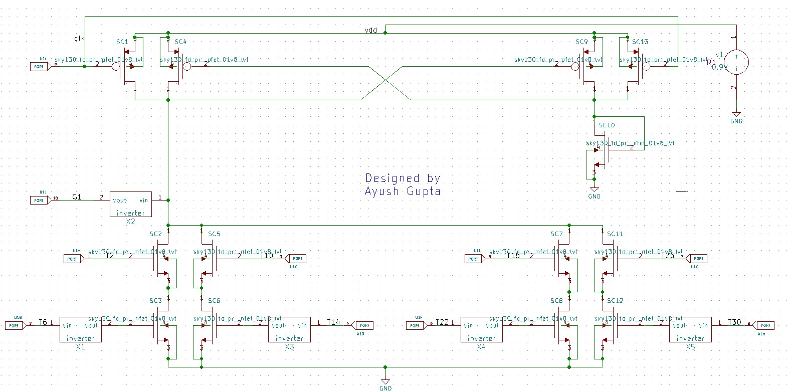 
  Fig. 10(a): Gray Bit-1 Generation Schematic

  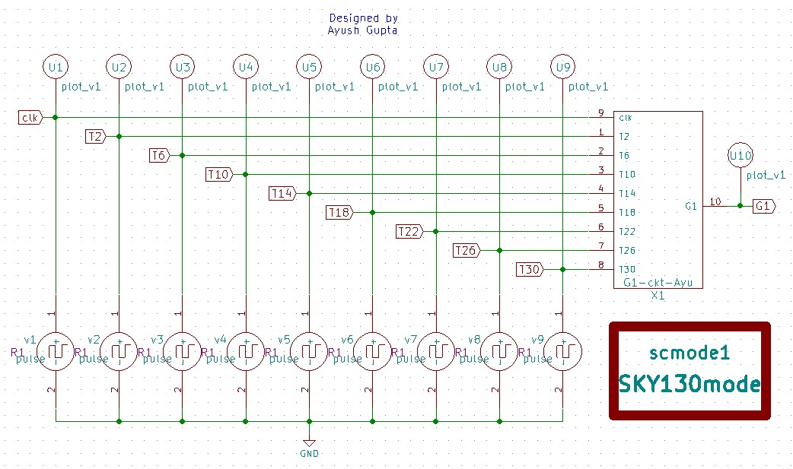 
  Fig. 10(b): Symbol and Testbench

### Gray bit-0 Circuit

  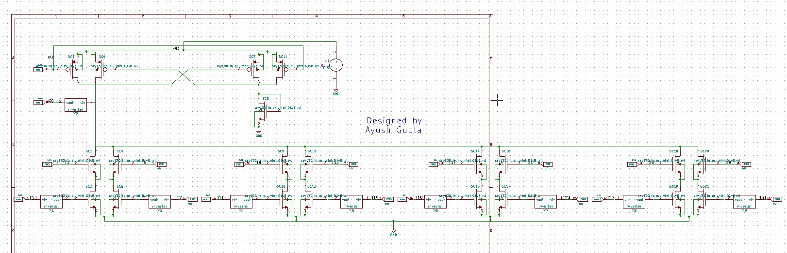 
  Fig. 11(a): Gray Bit-0 Generation Schematic

  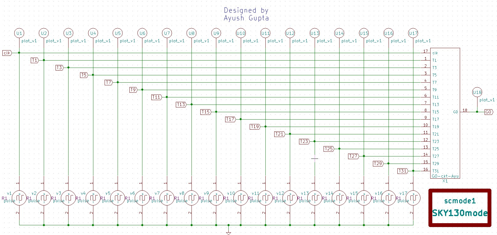 
  Fig. 11(b): Symbol and Testbench

## NgSpice Simulation

### LTE-Comparator

  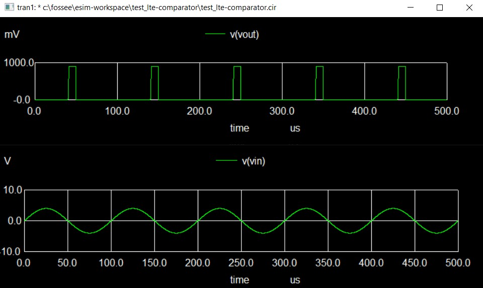 
  Fig. 12: Comparator Trans Analysis

Herewith is the Netlist generated for the above design:

	* c:\fossee\esim-workspace\test_lte-comparator\test_lte-comparator.cir

	.include LTE_Comp.sub
	.include "C:\FOSSEE\eSim\library\sky130_fd_pr\models\sky130_fd_pr__model__diode_pd2nw_11v0.model.spice"
	.include "C:\FOSSEE\eSim\library\sky130_fd_pr\models\sky130_fd_pr__model__linear.model.spice"
	.include "C:\FOSSEE\eSim\library\sky130_fd_pr\models\sky130_fd_pr__model__diode_pw2nd_11v0.model.spice"
	.include "C:\FOSSEE\eSim\library\sky130_fd_pr\models\sky130_fd_pr__model__inductors.model.spice"
	.include "C:\FOSSEE\eSim\library\sky130_fd_pr\models\sky130_fd_pr__model__r+c.model.spice"
	.include "C:\FOSSEE\eSim\library\sky130_fd_pr\models\sky130_fd_pr__model__pnp.model.spice"
	.lib "C:\FOSSEE\eSim\library\sky130_fd_pr\models\sky130.lib.spice" tt
	x1 vin vout net-_x1-pad3_ net-_x1-pad4_ net-_x1-pad5_ LTE_Comp
	v1  net-_x1-pad4_ gnd 1v
	v2  vin gnd sine(0 4V 10000 0 0)
	v4  net-_x1-pad3_ gnd 0.9v
	v3  net-_x1-pad5_ gnd 2v
	* s c m o d e
	* u1  vin plot_v1
	* u2  vout plot_v1
	.tran 10e-09 0.5e-03 0e-03

	* Control Statements 
	.control
	run
	print allv > plot_data_v.txt
	print alli > plot_data_i.txt
	plot v(vin)
	plot v(vout)
	.endc
	.end

### DCVSL Logic Thermometer to Gray Encoder

  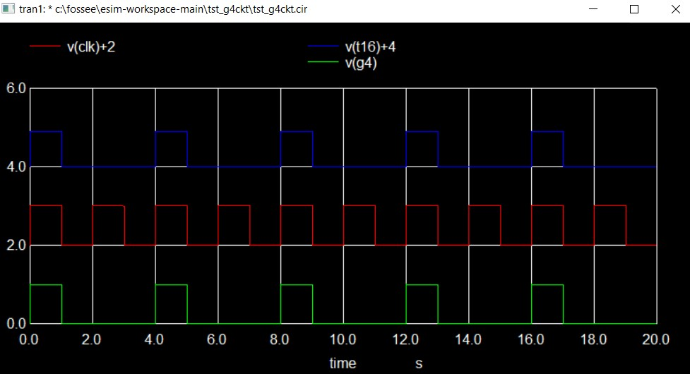 
  Fig. 13(a): Trans Analysis of G4 ckt

  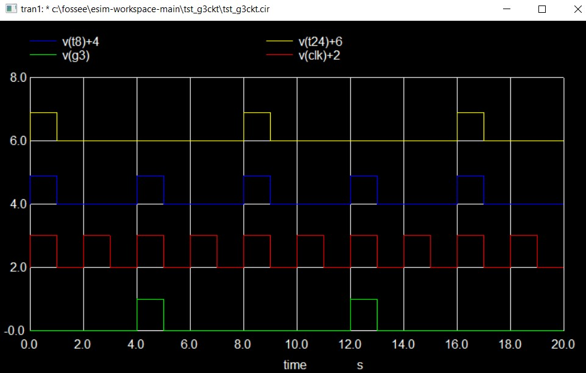 
  Fig. 13(b): Trans Analysis of G3 ckt

  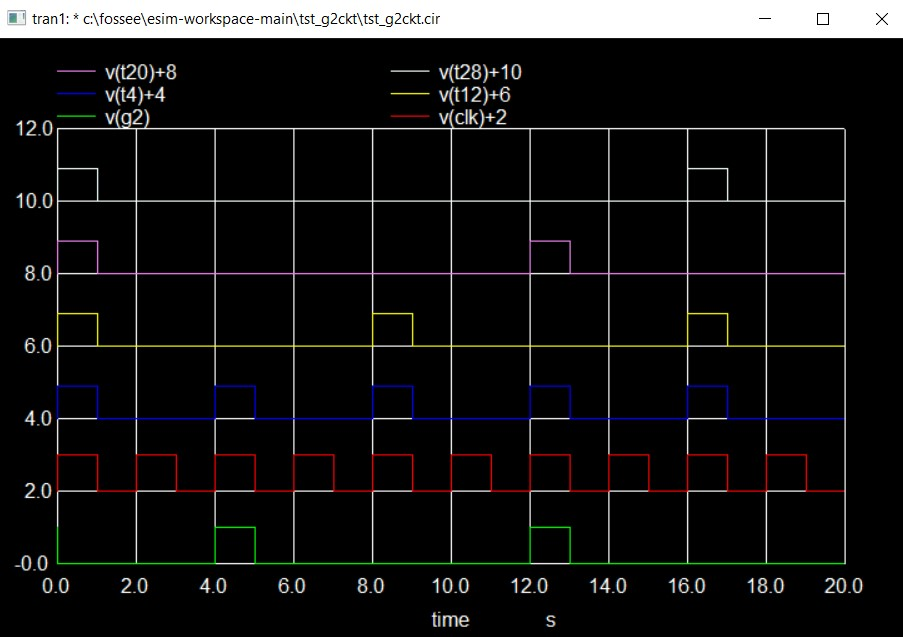 
  Fig. 13(c): Trans Analysis of G2 ckt

  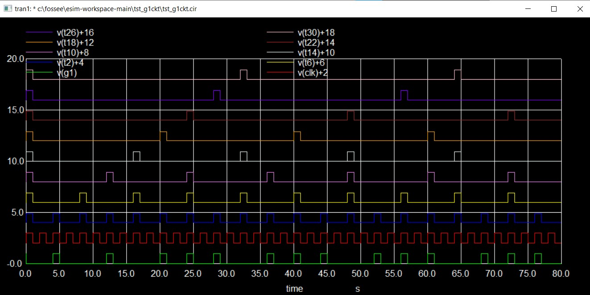 
  Fig. 13(d): Trans Analysis of G1 ckt

  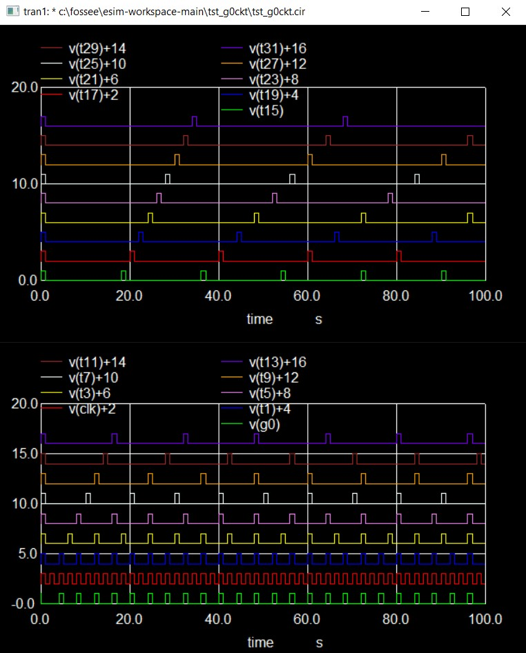 
  Fig. 13(e): Trans Analysis of G0 ckt

   
  Fig. 13(f): Trans Analysis of Complete Gray Enc ckt

Herewith is the Netlist generated for the above design:

	*  Generated for: 
	*  Design library name: 
	*  Design cell name: 
	*  Design view name: schematic
	.lib 

# Digital Logic Blocks Design and Simulation

## 5-to-32 Gray to Thermometer Decoder

### Verilog Code
For Behavioral Verilog code, refer to: <a href='https://github.com/guptayush2112/FlashADC_digital-logic_MixedSoC/blob/main/Verilog%20src%20codes/dec_gray532_bh.v'>5-to-32 Thermometer Decoder</a> 

### Makerchip IDE Simulation

  Fig. 14 (a): Decoder Output when Gray Bit = 00001

  Fig. 14 (b): Decoder Output when Gray Bit = 10000

### NgSpice block and Simulation

  Fig. 14 (c): 5-to-32 Decoder Block Test-setup

  Fig. 14 (d): Transient Analysis of Decoder Testbench for Gray bit = 11111

## 32-bit Priority Encoder

### Verilog Code
For Sturctural Verilog, refer to: <a href='https://github.com/guptayush2112/FlashADC_digital-logic_MixedSoC/blob/main/Verilog%20src%20codes/PE_32b_str.v'>32-bit Cascaded Priority Encoder with Active Low Inputs</a> 

### Makerchip IDE Simulation

The simulation for 4 different 5-bit Gray code combinations as per the truth table from Fig. 5(c) above is shown below.

  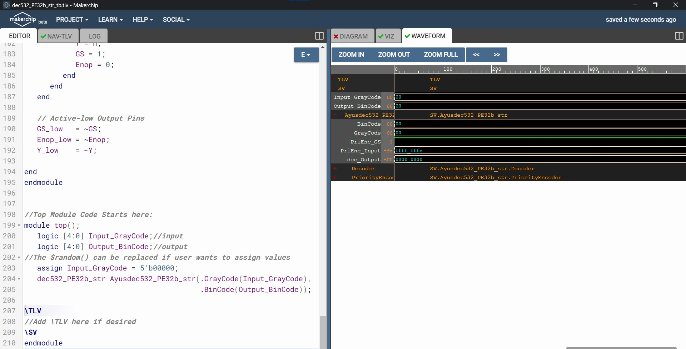 
  Fig. 15 (a): When Gray code Decoder input = 00000

   
  Fig. 15 (b): When Gray code Decoder input = 11111

  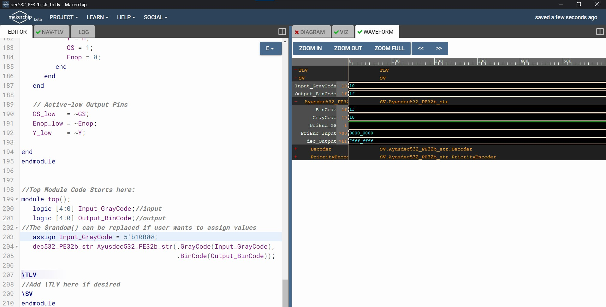 
  Fig. 15 (c): When Gray code Decoder input = 10000

  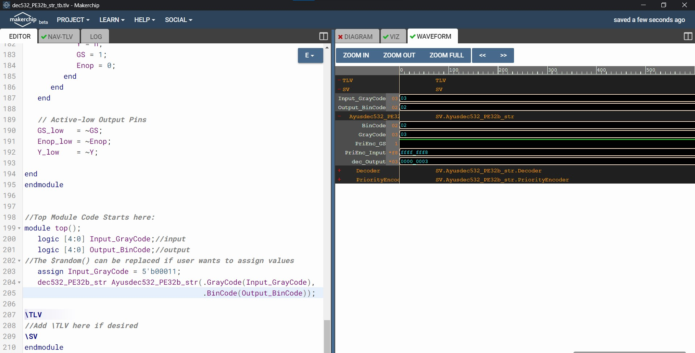 
  Fig. 15 (d): When Gray code Decoder input = 00011

### NgSpice block and Simulation

  Fig. 15 (e): 32-bit Priority Encoder Test-setup

  Fig. 15 (f): Transient Analysis of Priority Enc

# Observations & Conclusion
Thus, the Mixed Signal SoC comprising of LTE-Comparator based 5-bit Flash ADC using Thermometer to Gray Encoder and Custom Digital Logic interface of 5-to-32 Decoder and 32-bit Priority Encoder was successfully designed using eSim and Google SkyWater 130nm Process Design Kit: 

• The Flash ADC is working as expected giving the 5-bit Gray Code Output from the Analog Input. 
• The Digital Logic of Decoder and Priority Encoder was verified as it successfully decodes the Gray codes back to thermometer codes as well as converting them into Equivalent 5-bit Binary Codes . 

# Author
• Ayush Gupta, B.Tech(ECE), SRM Institute of Science and Technology, Kattankulattur, Chennai-603203.

# Acknowledgements
• <a href='https://in.linkedin.com/in/kunal-ghosh-vlsisystemdesign-com-28084836/'>Kunal Ghosh</a>, Founder, VSD Corporation Pvt. Ltd 
• <a href='https://fossee.in/'>FOSSEE, IIT Bombay</a> 
• <a href='https://skywater-pdk.readthedocs.io/en/main//'>Google SkyWater</a> 

# References
[1] Meghana Kulkarni1, V. Sridhar2 , G.H. Kulkarni3, 4-Bit Flash Analog to Digital Converter Design using CMOS-LTE Comparator M, 2010 IEEE Asia Pacific Conference on Circuits and Systems

[2] Rebbavarapu Ashok Vardhan,  M. Apparao,  D. MANOGNA, Design and Implementation of 5-Bit Low Power Dynamic Thermometer Encoder for Flash ADC, International Journal of Advanced Technology and Innovative Research Volume. 08, IssueNo.17, October-2016, Pages: 3268-3273

[3] G.L.Madhumati, K.Ramakoteswara Rao, M.Madhavi Latha, “Comparison Of 5-Bit Thermometer-To-Binary Decoders In 1.8V, 0.18μm CMOS Technology For Flash Adcs,” Proceedings Of 2009 International Conference On Signal Processing Systems (ICSPS 2009), May 15-17,2009, Singapore,Pp.516-520.

[4] Firas Hassan, Ahmed Ammar, and Hayden Drennen, A 32-bit Integer Division Algorithm Based on Priority Encoder, 978-1-7281-6044-3 ©2020 IEEE

[5] Leela S.Bitla, Design and Implementation Of 4 Bit Flash ADC using LTE and NAND Gate Comparator, International Journal of Engineering Research & Technology (IJERT), NCETECE'14 Conference Proceedings ISSN: 2278-0181

[6] Taninki Sai Lakshmi, Avireni Srinivasulu, and Pittala Chandra Shaker, Implementation of Power Efficient Flash Analogue-to-Digital Converter, Hindawi Publishing Corporation Active and Passive Electronic Components Volume 2014, Article ID 723053

[7] G. T. Varghese and K. K. Mahapatra, “A high speed low power encoder for a 5 bit flash ADC,” in Proceedings of the International Conference on Green Technologies (ICGT ’12), pp. 41–45, Trivandrum, India, December 2012.

[8] Ivan Marsic, Digital Logic Design, Electrical & Computer Engineering, Rutgers University, Fall 2013

[9] Mourad Fakhfakh, Esteban Tlelo-Cuautle, Maria Helena Fino, Performance Optimization Techniques in Analog, Mixed-Signal, and Radio-Frequency Circuit Design, Chapter 13, IGI Global book series Advances in Computer and Electrical Engineering (ACEE) (ISSN:2327-039X; eISSN: 2327-0403)

[10] A. Yukawa, “A CMOS 8-bit high-speed A/D converter IC.” IEEE J. Solid- State Circuits, vol. SC-20, pp 775-779, June 1985.

[11] S.Park And R. Schaumann, “A High-Frequency CMOS Linear Trasconductansce Element,” IEEE Trans. Circuits Syst, Vol. CAS-33, No.11, November, Pp. 1132-1138, 1986.
